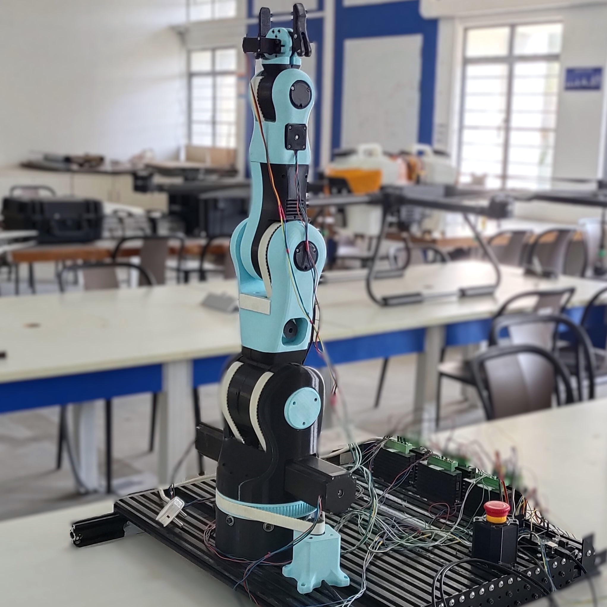

# Moveo 5-DOF Software (WIP)
This Repo contains the hardware setup and software configuration of the open source BCN3D-Moveo Robotic arm.<

The arm is fully 3d-printed with PLA and actuated by nema 17 and nema 23 stepper motors and controlled by an arduino mega microcontroller. More information about the robotic arm and BOM can be found here: https://github.com/BCN3D/BCN3D-Moveo

The software is developed for `ros1` with rviz config as well. The `ros1` and rviz part was originally developed by https://github.com/jesseweisberg/moveo_ros repo. I used the ros messages and serial communication packages from the above repo.

### Control for Robot

The robot was controlled by sending joint angles to the robot via serial communication. The joint angles are computed using `roboticstoolbox` package and the robot model was developed using DH-Parameters with the help of `roboticstoolbox` `DHRobot`.

Robot Model can be found in `Moveo.py`, and `/moveo_moveit/movements.py` file contains the movement script with the implementation of inverse kinematics from **roboticstoolbox**.